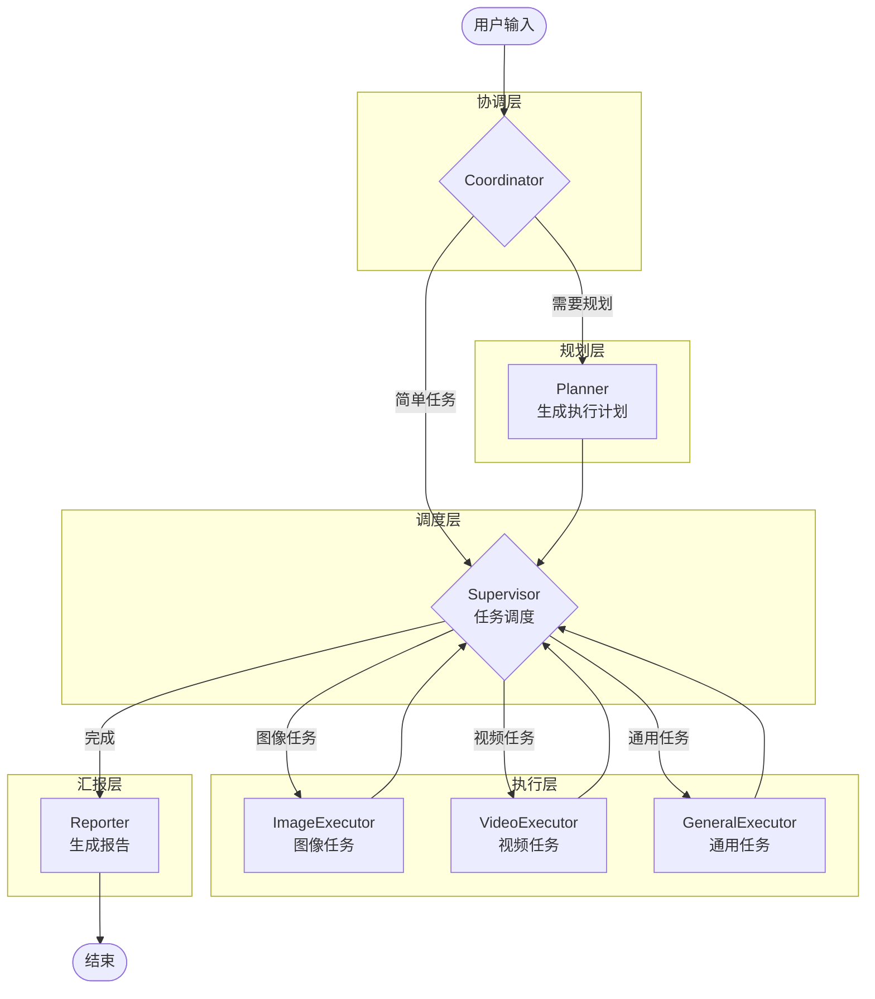

# 🎯 Planner & Supervisor 模块引入计划

> 参考项目：LangManus  
> 目标：为 LoopSkillAgent 引入规划者(Planner)和监督者(Supervisor)模块，实现更智能的任务编排

## 📋 目录

- [背景分析](#背景分析)
- [架构设计](#架构设计)
- [工程计划](#工程计划)
- [文件清单](#文件清单)
- [实施步骤](#实施步骤)
- [测试验证](#测试验证)

---

## 背景分析

### 当前架构

```
用户输入 → initial_prep → our_agent ⇄ tools → [suggestion] → END
```

当前是简单的 **ReAct 模式**：Agent 直接根据用户输入决定调用哪个工具，缺乏：
- 任务规划能力：无法将复杂任务分解为子任务
- 执行监督能力：无法根据执行结果动态调整策略

### 目标架构

```
用户输入 → coordinator → planner → supervisor ⇄ executors → reporter → END
```

引入 **Planner-Supervisor 模式**：
1. **Planner**：分析用户需求，生成结构化执行计划
2. **Supervisor**：根据计划调度执行者，监控执行进度

---

## 架构设计

### 新增模块职责

| 模块 | 职责 | 输入 | 输出 |
|------|------|------|------|
| **Coordinator** | 协调入口，判断是否需要规划 | 用户消息 | 路由决策 |
| **Planner** | 任务分解，生成执行计划 | 用户需求 | JSON 格式计划 |
| **Supervisor** | 执行调度，决定下一步 | 当前状态 + 计划 | 路由到具体执行者 |
| **ImageExecutor** | 图像生成/编辑执行 | 子任务 | 执行结果 |
| **VideoExecutor** | 视频生成执行 | 子任务 | 执行结果 |
| **Reporter** | 汇总报告 | 所有结果 | 最终回复 |

### 工作流设计



---

## 工程计划

### 阶段一：基础设施 (Day 1-2)

#### 1.1 扩展状态定义

**文件**: `state/schemas.py`

新增字段：
```python
class AgentState(TypedDict):
    # ... 现有字段 ...
    
    # === 新增：Planner & Supervisor 相关 ===
    full_plan: str | None           # 完整执行计划 (JSON)
    current_step: int               # 当前执行步骤索引
    step_results: list[dict] | None # 每步执行结果
    next_executor: str | None       # 下一个执行者
    
    # === 新增：执行上下文 ===
    task_context: dict | None       # 任务上下文信息
    execution_history: list[dict] | None  # 执行历史
```

#### 1.2 创建提示词模板

**新建文件**: `prompts/planner.md`
```markdown
---
CURRENT_TIME: <<CURRENT_TIME>>
---

你是一个专业的创作任务规划师。分析用户需求，制定详细的执行计划。

# 执行者能力
- **image_executor**: 图像生成、编辑、重绘、去水印
- **video_executor**: 文本生成视频、首帧驱动视频
- **general_executor**: 状态查询、配置管理

# 输出格式
直接输出 JSON，不要包含 ```json 标记：
{
  "thought": "对用户需求的理解",
  "title": "任务标题",
  "steps": [
    {
      "executor": "image_executor",
      "title": "步骤标题",
      "description": "详细描述",
      "depends_on": []
    }
  ]
}

# 规则
1. 合并连续的同类型步骤
2. 明确每步的输入输出
3. 使用与用户相同的语言
```

**新建文件**: `prompts/supervisor.md`
```markdown
---
CURRENT_TIME: <<CURRENT_TIME>>
---

你是一个任务监督者，负责协调执行者完成任务。

# 执行者列表
<<EXECUTORS>>

# 当前计划
<<CURRENT_PLAN>>

# 执行历史
<<EXECUTION_HISTORY>>

# 决策规则
1. 分析当前进度和计划
2. 选择下一个执行者
3. 返回 JSON: {"next": "executor_name"} 或 {"next": "FINISH"}
```

---

### 阶段二：核心节点实现 (Day 3-5)

#### 2.1 规划者节点

**新建文件**: `nodes/planner.py`

```python
# 核心功能：
# 1. 接收用户需求
# 2. 调用 LLM 生成结构化计划
# 3. 解析并验证 JSON 格式
# 4. 更新 state.full_plan
```

#### 2.2 监督者节点

**新建文件**: `nodes/supervisor.py`

```python
# 核心功能：
# 1. 读取 full_plan 和当前进度
# 2. 决定下一个执行者
# 3. 返回路由指令
```

#### 2.3 执行者节点

**新建文件**: `nodes/executors.py`

```python
# 拆分现有 core.py 的逻辑：
# - ImageExecutor: 处理图像相关任务
# - VideoExecutor: 处理视频相关任务
# - GeneralExecutor: 处理通用任务
```

#### 2.4 汇报者节点

**新建文件**: `nodes/reporter.py`

```python
# 核心功能：
# 1. 收集所有步骤结果
# 2. 生成用户友好的报告
```

---

### 阶段三：图构建器扩展 (Day 6-7)

#### 3.1 新增构建函数

**修改文件**: `graphs/builder.py`

新增函数：
```python
def create_planner_supervisor_graph(
    planner_llm: BaseChatModel,
    supervisor_llm: BaseChatModel,
    executor_llm: BaseChatModel,
    tools: list[BaseTool],
    enable_deep_thinking: bool = False
) -> CompiledStateGraph:
    """
    创建 Planner-Supervisor 模式的工作流图
    """
```

#### 3.2 路由逻辑

**修改文件**: `nodes/routers.py`

新增路由函数：
```python
def coordinator_router(state: AgentState) -> str:
    """判断是否需要规划"""

def supervisor_router(state: AgentState) -> str:
    """根据 supervisor 决策进行路由"""
```

---

### 阶段四：入口与配置 (Day 8)

#### 4.1 新建应用入口

**新建文件**: `apps/PlannerSupervisorTemplate.py`

```python
# 配置示例：
# - planner_llm: 使用 reasoning 能力强的模型
# - supervisor_llm: 使用快速响应的模型
# - executor_llm: 使用通用模型
```

#### 4.2 更新 langgraph.json

新增 graph 配置指向新的入口。

---

## 文件清单

### 新建文件

| 文件路径 | 说明 | 优先级 |
|----------|------|--------|
| `prompts/planner.md` | 规划者提示词模板 | P0 |
| `prompts/supervisor.md` | 监督者提示词模板 | P0 |
| `nodes/planner.py` | 规划者节点实现 | P0 |
| `nodes/supervisor.py` | 监督者节点实现 | P0 |
| `nodes/executors.py` | 执行者节点实现 | P1 |
| `nodes/reporter.py` | 汇报者节点实现 | P1 |
| `nodes/coordinator.py` | 协调者节点实现 | P1 |
| `apps/PlannerSupervisorTemplate.py` | 新模式入口 | P1 |

### 修改文件

| 文件路径 | 修改内容 | 优先级 |
|----------|----------|--------|
| `state/schemas.py` | 新增计划相关状态字段 | P0 |
| `graphs/builder.py` | 新增 Planner-Supervisor 图构建函数 | P0 |
| `nodes/routers.py` | 新增路由逻辑 | P0 |
| `prompts/templates.py` | 新增模板加载函数 | P1 |
| `langgraph.json` | 新增 graph 配置 | P2 |

---

## 实施步骤

### Step 1: 状态扩展 ✅ TODO

```bash
# 修改 state/schemas.py
# 添加 full_plan, current_step, step_results, next_executor 等字段
```

### Step 2: 提示词模板 ✅ TODO

```bash
# 创建 prompts/planner.md
# 创建 prompts/supervisor.md
# 修改 prompts/templates.py 支持 .md 模板加载
```

### Step 3: 节点实现 ✅ TODO

```bash
# 创建 nodes/planner.py
# 创建 nodes/supervisor.py
# 创建 nodes/executors.py
# 创建 nodes/reporter.py
```

### Step 4: 路由与图构建 ✅ TODO

```bash
# 修改 nodes/routers.py
# 修改 graphs/builder.py
```

### Step 5: 入口配置 ✅ TODO

```bash
# 创建 apps/PlannerSupervisorTemplate.py
# 更新 langgraph.json
```

---

## 测试验证

### 单元测试

| 测试项 | 验证内容 |
|--------|----------|
| Planner 输出格式 | JSON 解析正确，包含必要字段 |
| Supervisor 路由 | 正确路由到对应执行者 |
| 状态传递 | full_plan, step_results 正确更新 |

### 集成测试

| 测试场景 | 预期行为 |
|----------|----------|
| 简单图像生成 | coordinator → image_executor → reporter |
| 复杂创作流程 | coordinator → planner → supervisor ⇄ executors → reporter |
| 图转视频任务 | 规划为两步：先生图，再转视频 |

### 测试命令

```bash
# 启动开发服务器
langgraph dev

# 测试简单任务
curl -X POST http://localhost:8000/api/chat \
  -H "Content-Type: application/json" \
  -d '{"messages": [{"role": "user", "content": "生成一张海边日落的图片"}]}'

# 测试复杂任务
curl -X POST http://localhost:8000/api/chat \
  -H "Content-Type: application/json" \
  -d '{"messages": [{"role": "user", "content": "先生成一张海边日落的图片，然后把它转成一段10秒的视频"}]}'
```

---

## 时间估算

| 阶段 | 工作量 | 预计时间 |
|------|--------|----------|
| 阶段一：基础设施 | 状态扩展 + 提示词 | 1-2 天 |
| 阶段二：核心节点 | Planner + Supervisor + Executors | 2-3 天 |
| 阶段三：图构建 | builder 扩展 + 路由 | 1-2 天 |
| 阶段四：入口配置 | 应用入口 + 配置 | 0.5-1 天 |
| 测试与调优 | 单测 + 集成测试 | 1-2 天 |
| **总计** | | **6-10 天** |

---

## 后续优化方向

1. **深度思考模式**：Planner 支持切换 reasoning LLM
2. **规划前搜索**：复杂任务先搜索参考案例
3. **失败重试**：Supervisor 支持执行失败后重试
4. **并行执行**：无依赖的步骤并行执行
5. **人工介入**：支持暂停等待人工确认

---

## 参考资料

- [LangManus 项目](https://github.com/langmanus/langmanus)
- [LangGraph 文档](https://langchain-ai.github.io/langgraph/)
- [CAMEL Workforce](https://github.com/camel-ai/camel)

---

*文档创建时间: 2024-12*  
*最后更新: 2024-12*

