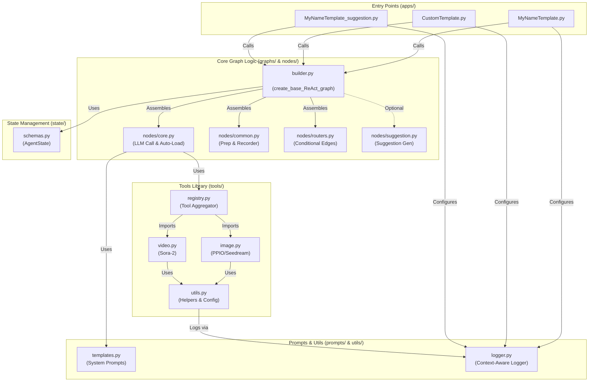

# 🎬 MyNameChat - AI 视频/图像连续创作助手 (重构版)

基于 **LangGraph** 构建的模块化智能创作助手，旨在提供**任意主题下的 AI 视频/图像创作流程辅助**。

本项目以《你的名字》(君の名は) 续集创作为演示案例（Demo），实际上采用 **节点工厂 (Node Factory)** 与 **图构建器 (Graph Builder)** 架构，支持通过配置快速构建不同风格的创作 Agent。

在保持**连续修图**、**自动上下文加载**以及**多模态生成**等核心能力的同时，新的架构极大地提高了代码的复用性和扩展性。

## ✨ 核心特性

### 🏗️ 架构升级
*   **Multi-Agent 架构**：通过图 (Graph) 编排，灵活组合 LLM、工具和状态管理。
*   **Factory 模式**：使用工厂函数动态生成节点，消除重复代码，轻松扩展新 Agent。
*   **模块化设计**：业务逻辑（Nodes）、工具（Tools）、提示词（Prompts）与配置（Apps）彻底分离。

### 🧠 智能状态管理
*   **自动加载 (Auto-Load)**：无需重复上传，Agent 会自动检测并加载上一轮生成的图片作为新任务的参考素材。
*   **连续创作**：支持基于上一轮结果进行 "Retry"（重绘）或 "Edit"（修图）。
*   **全局配置**：持久化风格、分辨率配置。

### 🎨 高级生成引擎
*   **图像引擎 (PPIO / Banana Pro)**：集成 PPIO Nano Banana Pro 模型，支持高质量图像生成与局部重绘。采用异步 + 数据库 (Supabase) 架构追踪任务。
*   **视频引擎 (KIE / Sora-2)**：支持 Text-to-Video 和 Image-to-Video (首帧驱动)。

### 💡 智能交互
*   **建议生成**：可选挂载“建议生成节点”，根据对话上下文为用户提供后续操作指引（如：修图建议、转视频建议）。

## 📁 工程架构



```text
MyNameChat/
├── apps/                # [入口] 应用配置层 (Thin Wrappers)
│   ├── MyNameTemplate.py             # [旧版] 格式化输出 Demo (统一输出 Answer + Suggestions)
│   ├── MyNameTemplate_suggestion.py  # [新版] 推荐架构：流式输出对话 + 独立节点生成建议 (适配前端流式)
│   └── CustomTemplate.py             # [通用] 用户自定义创作模块 (支持任意主题配置)
├── graphs/              # [核心] 图编排层
│   └── builder.py                    # 通用 Graph 构建工厂
├── nodes/               # [核心] 节点逻辑层
│   ├── core.py                       # LLM 调用与自动回捞逻辑
│   ├── common.py                     # 通用预处理与记录器
│   ├── suggestion.py                 # 建议生成节点
│   └── routers.py                    # 路由控制
├── state/               # [核心] 状态定义
│   └── schemas.py                    # AgentState 数据结构
├── tools/               # [核心] 工具库
│   ├── image.py                      # 图像生成/编辑 (Seedream, Banana)
│   ├── video.py                      # 视频生成 (Sora)
│   ├── general.py                    # 通用工具 (状态查询, 去水印)
│   └── registry.py                   # 工具注册表
├── prompts/             # [核心] 提示词管理
│   └── templates.py                  # System Prompts 和工具描述
├── utils/               # [辅助] 通用工具
│   └── logger.py                     # 日志记录器
├── langgraph.json       # [配置] LangGraph 服务配置文件
└── .env                 # [配置] 环境变量
```

## 🚀 快速开始

### 1. 环境准备

确保已安装 Python 3.11+ 和依赖包：

```bash
pip install -r requirements.txt
```

### 2. 配置环境变量

在项目根目录创建 `.env` 文件（参考之前的配置）：

```env
# LLM
OPENAI_API_KEY=sk-your-key
DOUBAO_API_KEY=your-key # 如果使用豆包

# KIE Services
KIE_API_KEY=your-kie-key

# PPIO Services
GEMINI_API_KEY=your-ppio-key

# Supabase
VITE_SUPABASE_URL=your-url
VITE_SUPABASE_ANON_KEY=your-key
```

### 3. 运行应用

#### LangGraph Server (推荐)
本项目遵循 LangGraph 标准结构，支持直接启动 API 服务：

```bash
langgraph dev
```

## 🔄 工作流逻辑 (Refactored)

新架构下的数据流转更加清晰：

1.  **Initial Prep (`nodes/common.py`)**: 解析输入，初始化 State。
2.  **Model Call (`nodes/core.py`)**: 
    *   **Auto-Load Logic**: 检查 `model_call_count` 和 `last_task_id`，必要时自动回捞上一轮结果并注入 Prompt。
    *   **LLM Execution**: 调用绑定了工具的 LLM。
3.  **Router (`nodes/routers.py`)**: 判断 LLM 是否发起了工具调用。
4.  **Tool Execution (`tools/`)**: 执行具体工具（PPIO/KIE），返回 `task_id`。
5.  **Recorder (`nodes/common.py`)**: 捕获工具输出，更新 `last_task_id` 等状态，为下一轮 Auto-Load 做准备。
6.  **Suggestion (Optional) (`nodes/suggestion.py`)**: 如果开启了建议功能，在对话结束前生成后续指引。

## 📝 可用工具

| 工具名称 | 功能描述 | 对应文件 |
|---------|----------|----------|
| `image_edit_by_ppio_banana_pro_create_task` | **[主力]** 图像生成/编辑 | `tools/image.py` |
| `text_to_video_by_kie_sora2_create_task` | 文本生成视频 | `tools/video.py` |
| `first_frame_to_video_by_kie_sora2_create_task` | 首帧驱动视频 | `tools/video.py` |
| `remove_watermark_from_image_by_kie_seedream_v4_create_task` | 去除水印 | `tools/image.py` |
| `get_task_status` | 统一状态查询 | `tools/general.py` |

## 🤝 贡献
欢迎提交 Pull Request 或 Issue。

## 📄 许可证
MIT License
