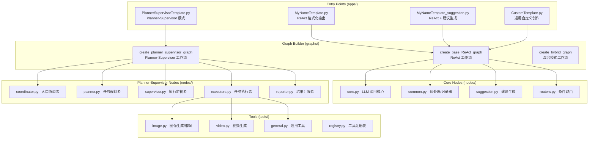

# 🎬 LoopSkill - AI 视频/图像连续创作助手 (重构版)

基于 **LangGraph** 构建的模块化智能创作助手，旨在提供**任意主题下的 AI 视频/图像创作流程辅助**。

本项目支持两种工作模式：
- **ReAct 模式**：适用于单步任务，快速响应用户请求
- **Planner-Supervisor 模式**：对标 LangManus 架构，适用于复杂多步任务的自动规划与执行

在保持**连续修图**、**自动上下文加载**以及**多模态生成**等核心能力的同时，新的架构极大地提高了代码的复用性和扩展性。

## ✨ 核心特性

### 🏗️ 双模式架构
*   **ReAct 模式**：经典的 Reasoning + Acting 循环，适用于简单任务
*   **Planner-Supervisor 模式**：对标 LangManus，支持复杂任务的自动规划与多角色协作
*   **Factory 模式**：使用工厂函数动态生成节点，消除重复代码，轻松扩展新 Agent
*   **模块化设计**：业务逻辑（Nodes）、工具（Tools）、提示词（Prompts）与配置（Apps）彻底分离

### 🧠 智能状态管理
*   **自动加载 (Auto-Load)**：无需重复上传，Agent 会自动检测并加载上一轮生成的图片作为新任务的参考素材
*   **连续创作**：支持基于上一轮结果进行 "Retry"（重绘）或 "Edit"（修图）
*   **动态工具配置**：支持运行时动态加载/禁用工具，前端可通过 `EXECUTOR_TOOLS` 控制工具的启用

### 🎨 高级生成引擎
*   **图像引擎**：
    - KIE Seedream V4：高质量图像生成与编辑
    - PPIO Banana Pro：高级图像编辑，采用异步 + Supabase 架构追踪任务
*   **视频引擎**：
    - KIE Sora-2：支持 Text-to-Video 和 Image-to-Video（首帧驱动）

### 📡 流式输出支持
*   使用 `get_stream_writer()` 发送不同类型的流式事件：
    - `{"delta": "..."}`: 文本内容流式输出
    - `{"thought": "..."}`: Planner 思考过程
    - `{"tool_name": "...", "tool_result": "..."}`: 工具执行结果
    - `{"type": "start/end"}`: 开始/结束事件

## 📁 工程架构



```text
LoopSkillAgent/
├── apps/                # [入口] 应用配置层 (Thin Wrappers)
│   ├── MyNameTemplate.py             # ReAct 模式：格式化输出 Demo
│   ├── MyNameTemplate_suggestion.py  # ReAct 模式：流式输出 + 独立建议生成节点
│   ├── CustomTemplate.py             # ReAct 模式：用户自定义创作
│   └── PlannerSupervisorTemplate.py  # Planner-Supervisor 模式入口
├── graphs/              # [核心] 图编排层
│   └── builder.py                    # 图构建工厂 (ReAct / Planner-Supervisor / Hybrid)
├── nodes/               # [核心] 节点逻辑层
│   ├── core.py                       # ReAct: LLM 调用与自动回捞
│   ├── common.py                     # 通用预处理与记录器
│   ├── suggestion.py                 # 建议生成节点
│   ├── routers.py                    # 路由控制 (支持两种模式)
│   ├── coordinator.py                # PS: 入口协调者
│   ├── planner.py                    # PS: 任务规划者
│   ├── supervisor.py                 # PS: 执行监督者
│   ├── executors.py                  # PS: 任务执行者 (Image/Video/StatusChecker)
│   └── reporter.py                   # PS: 结果汇报者
├── state/               # [核心] 状态定义
│   └── schemas.py                    # AgentState (支持动态工具配置)
├── tools/               # [核心] 工具库
│   ├── image.py                      # 图像生成/编辑 (Seedream V4, Banana Pro)
│   ├── video.py                      # 视频生成 (Sora-2)
│   ├── general.py                    # 通用工具 (状态查询)
│   └── registry.py                   # 工具注册表
├── prompts/             # [核心] 提示词管理
│   ├── templates.py                  # 模板加载器 (对标 LangManus)
│   ├── coordinator.md                # Coordinator 提示词
│   ├── planner.md                    # Planner 提示词
│   ├── supervisor.md                 # Supervisor 提示词
│   ├── image_executor.md             # ImageExecutor 提示词
│   ├── video_executor.md             # VideoExecutor 提示词
│   ├── status_checker.md             # StatusChecker 提示词
│   └── reporter.md                   # Reporter 提示词
├── service/             # [服务] API 层
│   ├── api.py                        # FastAPI 服务
│   └── langgraph_client.py           # LangGraph 客户端
├── utils/               # [辅助] 通用工具
│   └── logger.py                     # 日志记录器
├── langgraph.json       # [配置] LangGraph 服务配置文件
└── .env                 # [配置] 环境变量
```

## 🚀 快速开始

### 1. 环境准备

确保已安装 Python 3.11+ 和依赖包：

```bash
pip install -r requirements.txt
```

### 2. 配置环境变量

在项目根目录创建 `.env` 文件：

```env
# LLM 配置
DOUBAO_API_KEY=your-doubao-key
DOUBAO_BASE_URL=https://ark.cn-beijing.volces.com/api/v3
BASIC_MODEL=doubao-seed-1-8-251215

# OpenAI 兼容配置 (可选)
OPENAI_API_KEY=your-openai-key
OPENAI_BASE_URL=https://api.openai.com/v1

# 推理增强模型 (可选，用于 Planner 深度思考)
REASONING_MODEL=your-reasoning-model
REASONING_API_KEY=your-key
REASONING_BASE_URL=your-base-url

# KIE Services
KIE_API_KEY=your-kie-key

# PPIO Services (Gemini API)
GEMINI_API_KEY=your-ppio-key

# Supabase (用于 PPIO 任务状态追踪)
VITE_SUPABASE_URL=your-url
VITE_SUPABASE_ANON_KEY=your-key
```

### 3. 运行应用

#### LangGraph Server (推荐)
本项目遵循 LangGraph 标准结构，支持直接启动 API 服务：

```bash
langgraph dev
```

> ⚠️ **注意事项 (stream 分支)**  
> 当前 `service/` 目录下的自定义 API **无法在 LangGraph Cloud 云端环境运行**。  
> 如需实现流式返回，请使用 LangGraph SDK 中的 **Custom Mode** 进行流式调用。

## 🔄 工作流逻辑

### ReAct 模式 (MyNameTemplate / CustomTemplate)

```
START → initial_prep → our_agent ←→ tools → recorder → END
                          ↓
                  (可选) suggestion_generator → END
```

1. **Initial Prep** (`nodes/common.py`): 解析输入，初始化 State
2. **Model Call** (`nodes/core.py`): 
   - **Auto-Load Logic**: 检查 `model_call_count` 和 `last_task_id`，自动回捞上一轮结果
   - **LLM Execution**: 调用绑定工具的 LLM
3. **Router** (`nodes/routers.py`): 判断是否有工具调用
4. **Tool Execution** (`tools/`): 执行具体工具（PPIO/KIE）
5. **Recorder** (`nodes/common.py`): 捕获工具输出，更新状态
6. **Suggestion** (可选) (`nodes/suggestion.py`): 生成后续建议

### Planner-Supervisor 模式 (PlannerSupervisorTemplate)

```
START → coordinator → planner → supervisor ←→ executors → reporter → END
```

1. **Coordinator** (`nodes/coordinator.py`): 
   - 处理用户输入，判断是否需要规划
   - 简单问候直接回复，复杂任务转发 Planner
   
2. **Planner** (`nodes/planner.py`): 
   - 分析用户需求，生成结构化执行计划
   - 支持深度思考模式 (使用 reasoning_llm)
   
3. **Supervisor** (`nodes/supervisor.py`): 
   - 根据计划调度执行者
   - 使用 `with_structured_output` 强制结构化决策
   
4. **Executors** (`nodes/executors.py`): 
   - **ImageExecutor**: 图像生成/编辑任务
   - **VideoExecutor**: 视频生成任务
   - **StatusChecker**: 任务状态查询
   - 支持动态工具配置，执行前校验工具可用性
   
5. **Reporter** (`nodes/reporter.py`): 
   - 根据执行结果生成最终报告
   - 流式输出报告内容

## 📝 可用工具

| 工具名称 | 功能描述 | 对应文件 |
|---------|----------|----------|
| `text_to_image_by_kie_seedream_v4_create_task` | 文本生成图像 | `tools/image.py` |
| `image_edit_by_kie_seedream_v4_create_task` | KIE Seedream 图像编辑 | `tools/image.py` |
| `image_edit_by_ppio_banana_pro_create_task` | **[主力]** PPIO Banana Pro 图像编辑 | `tools/image.py` |
| `remove_watermark_from_image_by_kie_seedream_v4_create_task` | 去除水印 | `tools/image.py` |
| `text_to_video_by_kie_sora2_create_task` | 文本生成视频 | `tools/video.py` |
| `first_frame_to_video_by_kie_sora2_create_task` | 首帧驱动视频 | `tools/video.py` |
| `get_task_status` | 统一状态查询 (支持 KIE/PPIO) | `tools/general.py` |

## ⚙️ 动态工具配置

Planner-Supervisor 模式支持运行时动态配置每个执行者可用的工具：

```python
# 默认配置 (state/schemas.py)
DEFAULT_EXECUTOR_TOOLS = {
    "image_executor": [
        "text_to_image",
        "image_edit",
        "image_edit_banana_pro",
        "remove_watermark",
    ],
    "video_executor": [
        "text_to_video",
        "first_frame_to_video",
    ],
    "status_checker": [
        "get_task_status",
    ],
    "reporter": [],  # Reporter 不使用工具
}

# 前端可通过传入 EXECUTOR_TOOLS 自定义配置
state["EXECUTOR_TOOLS"] = {
    "image_executor": ["image_edit_banana_pro"],  # 仅启用 Banana Pro
    "video_executor": [],  # 禁用所有视频工具
}
```

## 📦 LangGraph 配置

`langgraph.json` 中定义了可用的 Graph 入口：

```json
{
  "graphs": {
    "my_name_chat_agent": "./apps/MyNameTemplate.py:app",
    "custom_chat_agent": "./apps/CustomTemplate.py:app",
    "my_name_suggestion_chat_agent": "./apps/MyNameTemplate_suggestion.py:app",
    "planner_supervisor_agent": "./apps/PlannerSupervisorTemplate.py:app"
  }
}
```

## 🤝 贡献
欢迎提交 Pull Request 或 Issue。

## 📄 许可证
MIT License
